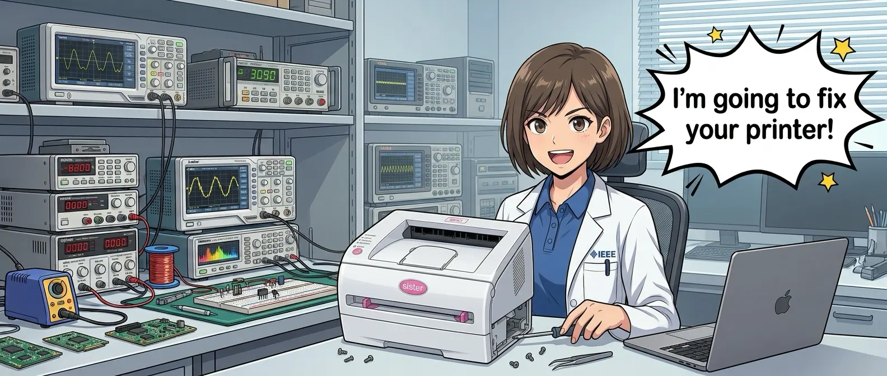

# SisterHL2030

<div align="center">
  
</div>

A modern, native driver for the Brother HL-2030 laser printer on Apple
Silicon Macs.

## Why this exists

The Brother HL-2030 is a great little printer, but Brother stopped updating
its Mac driver years ago. The old driver only runs today because of
**Rosetta 2**, the compatibility layer that lets Intel-only apps run on
Apple Silicon Macs, and Apple has announced that a future version of macOS
will remove Rosetta 2 entirely. When that happens, the official Brother
driver will simply stop working, and an otherwise perfectly good printer
would become e-waste.

SisterHL2030 is a from-scratch driver, written natively for Apple Silicon,
so your HL-2030 keeps working long after Rosetta 2 is gone.

While rebuilding the driver, it also picked up a feature Brother's own
driver never had: **AirPrint**. With the printer connected to your Mac over
USB and printer sharing turned on in System Settings, every device on your
network (other Macs, iPhones, iPads) can print to it wirelessly, no
drivers required on their end.

## Is this for you?

If you have a Brother HL-2030 (or HL-2030R) connected to an Apple Silicon
Mac (M1 or newer) by USB, yes.

This driver does **not** work with the printer over a network/Wi-Fi
connection, and it does not support Intel Macs. Plug the printer directly
into the Apple Silicon Mac that will host it, then turn on sharing (see
below) so that Mac shares it with everything else.

## Two print styles

SisterHL2030 ships as two installers that differ in exactly one thing: how
photos and shaded areas are turned into the dots this laser actually prints.
Everything else — quality modes, AirPrint sharing, supply levels — is
identical either way, and you can install the other one later if you change
your mind; it just replaces the one already there.

* **Newspaper style** — `InstallSisterDrivers(NewspaperStyle).pkg`. Dots are
  grouped into a crisp, evenly-spaced grid, the way a halftone photo looks
  in a printed newspaper. It is better for people that only print office
  documents. The graphical resolution is noticeably lower, but on this
  cheap printer it produces clearer patterns for color graphics.
* **Pencil style** — `InstallSisterDrivers(PencilStyle).pkg`. Dots are
  scattered individually (a technique called Atkinson dithering, the one
  classic Mac graphics software used), giving a soft, sketchy texture like
  pencil shading. Smoother gradients on photos; softer edges on line art and
  text.

Not sure which? Pencil style is the one this driver has always shipped
with — reach for Newspaper style if what you print is mostly documents,
line art or text rather than photos.

## Installing

1. Go to the [Releases page](https://github.com/RuiNelson/SisterHL2030/releases)
   and download the latest set of installer packages, including whichever
   one of `InstallSisterDrivers(NewspaperStyle).pkg` or
   `InstallSisterDrivers(PencilStyle).pkg` matches the style you want (see
   above).
2. If you still have Brother's official driver installed, double-click
   **`UninstallBrotherDrivers.pkg`** first and follow the prompts. The two
   drivers can't be installed side by side.
3. Plug the printer into your Mac with a USB cable and turn it on.
4. Double-click the `InstallSisterDrivers(...).pkg` you picked and follow
   the prompts. macOS will ask for your administrator password, which is
   normal for anything that installs system software.

The printer will now show up in System Settings → Printers & Scanners on
this Mac, and you can print to it right away from here.

<div align="center">
  
</div>

### Sharing it with other devices (AirPrint)

To print from other Macs, iPhones, or iPads on your network, you need to
turn sharing on for this printer; it is not shared automatically:

1. Open **System Settings → General → Sharing**.
2. Turn on **Printer Sharing**, then click the ⓘ next to it.
3. Check the box next to the HL-2030 to share it.

Once that's on, the printer appears in the Print dialog on every
AirPrint-capable device on the same network, for as long as this Mac is
awake and the printer is connected and powered on.

All installers are signed with a Developer ID certificate, so macOS will let
you open them normally (you may still see a first-run Gatekeeper prompt,
which is expected for software from outside the App Store).

### Uninstalling

Double-click **`UninstallSisterDrivers.pkg`** from the same release. It
removes the driver, its background service, and the printer queue, and
leaves nothing behind.

## What you get

* **Native Apple Silicon**: no Rosetta 2, no emulation.
* **AirPrint**: print from any Mac, iPhone, or iPad on the network, once
  the printer is connected to one Mac over USB and sharing is turned on.
* **Correct scaling**: pages print at 100% by default (older setups on
  Apple Silicon are prone to printing everything at half-size).
* **Good-looking output**: a choice of two halftone styles for photos and
  shading, Newspaper or Pencil (see above), each tuned for this printer's
  resolutions.
* **Toner and drum levels**: shown right in System Settings' Supply Levels
  panel, same as a modern printer.
* **Three quality modes**: Draft (300 dpi), Normal (600 dpi), and Fine
  (1200×600 dpi), each halftoned at its own resolution rather than rescaled
  from another one.

## How it works, briefly

The HL-2030 is a "host-based" printer: it has no PostScript, PCL, or
AirPrint smarts of its own, so whatever computer it's plugged into has to
do all the work: turning the page into dots, choosing which dots become
toner, and speaking Brother's own compressed language over USB. That's what
this driver does. It runs as a small background service (a "printer
application") that takes over the job the manual work would otherwise
require, then adds the AirPrint sharing on top.

The wire format was recovered by studying Brother's own Linux drivers and
double-checking the result against the real, official macOS driver on
actual hardware; see [`docs/protocol.md`](docs/protocol.md) if you're
curious about the details. None of Brother's proprietary code is compiled
into this driver; it's a clean-room reimplementation.

## For developers

Building from source requires CMake 3.20+ and a C++17 compiler (Apple
Clang is enough):

```sh
cmake -S . -B build -DCMAKE_BUILD_TYPE=Release
cmake --build build
ctest --test-dir build --output-on-failure
```

That builds the encoder library, the tests, and the CLI tools. The printer
application itself is built with an extra flag, since it downloads and
builds [PAPPL](https://github.com/michaelrsweet/pappl) 1.4.x (pinned by
checksum) the first time:

```sh
cmake -S . -B build -DCMAKE_BUILD_TYPE=Release -DSISTER_WITH_PAPPL=ON
cmake --build build --target sister-printer-app
```

`Scripts/` has the shell-based install/uninstall path used during
development (as opposed to the `.pkg` installers used for releases):

```sh
"Scripts/Uninstall Official Brother Drivers.sh"   # if needed, run first
"Scripts/Install Sister HL2030.sh"
```

Both ask for an administrator password and refuse to run if the official
Brother package is still present; the install script also asks which
halftone style to build (see [Two print styles](#two-print-styles) above).
`Scripts/Uninstall Sister HL2030.sh` reverses it.
`Scripts/build_distribution_packages.sh` builds the four signed `.pkg`
files that ship in each release: one `InstallSisterDrivers` per style, plus
the two uninstallers.

To turn a bitmap into a HL-2030 job stream directly, without printing:

```sh
./build/sister-rawtobr < page.pbm > job.bin
```

And to decode a job stream back into a bitmap, to check what would land on
paper without spending any:

```sh
python3 Scripts/decode_job.py job.bin out.pbm
```

See [`CLAUDE.md`](CLAUDE.md) for the full architecture writeup, and
[`docs/protocol.md`](docs/protocol.md) /
[`docs/reverse-engineering.md`](docs/reverse-engineering.md) for how the
wire format was recovered.

## Hardware

| | |
| --- | --- |
| Model | Brother HL-2030 series |
| USB | Vendor `0x04f9`, product `0x0027` |
| Connection | USB only (no network/Wi-Fi support) |
| Resolutions | 300, 600, and 1200×600 (Fine) dpi |
| Duplex | Not supported |

## License

GNU GPL v2 or later. See [LICENSE](LICENSE) and [NOTICE](NOTICE).

Brother's original Linux packages were used locally, during development
only, as a protocol reference; they are not included in this repository and
none of their proprietary code is compiled into this driver. This project's
license matches the GPL-2 CUPS wrapper sources Brother already shipped, and
stays compatible with [brlaser](https://github.com/pdewacht/brlaser), an
independent open-source driver for related Brother models.
